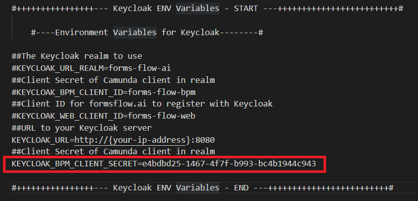
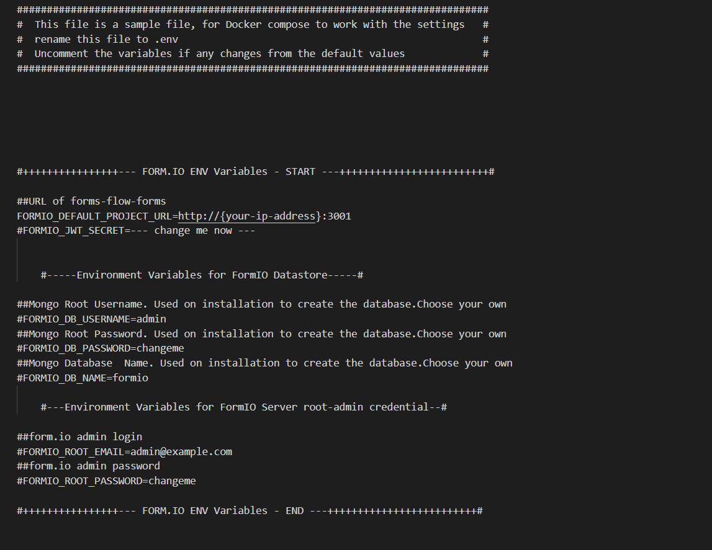
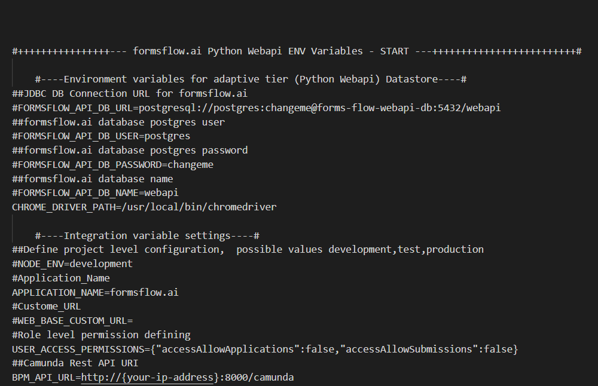
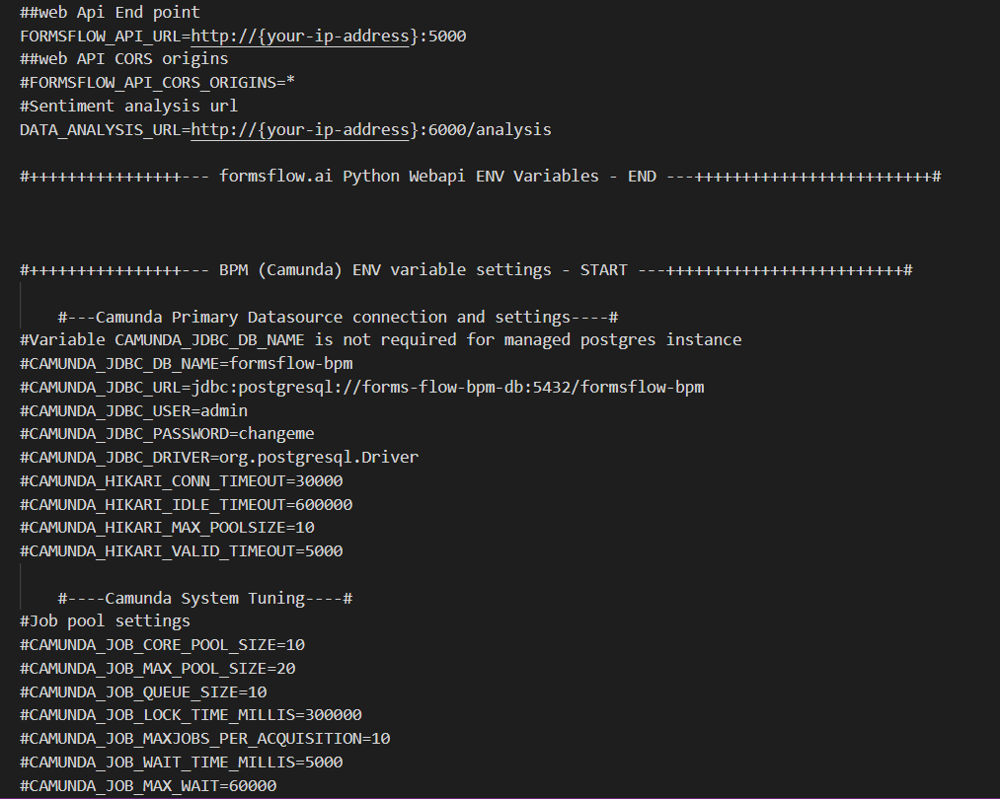
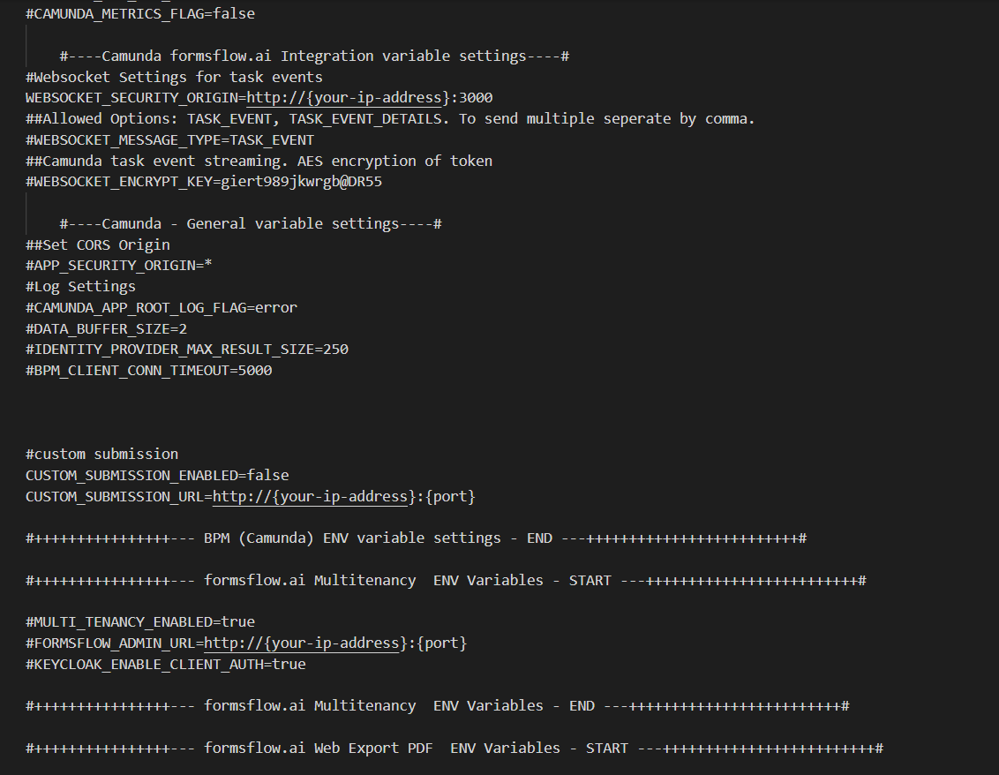
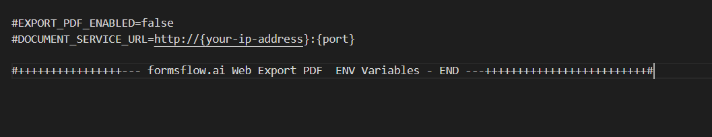

## Docker Full Deployment

### Installation Steps
\
Following steps are required to complete the installation and setup of formsflow.ai solution:  

- Keycloak setup
- forms-flow-analytics setup
- forms-flow-forms ,forms-flow-web, forms-flow-bpm, forms-flow-api setup  

> ####  Notice
> *Make sure you have a Docker machine up and running*.  
{: .bg-grey-lt-000}

### 1. Keycloak Setup.
  Keycloak is an open source software product to allow single sign-on with identity and access management aimed at modern applications and services.

  To install Keycloak follow the instructions given [here](https://aot-technologies.github.io/forms-flow-ai-doc/local_keycloaksetup.html). 
   

### 2. forms-flow-analytics Setup.  
Redash is used to build analytics dashboards. The analytics server can be started by following the instructions given [here](https://aot-technologies.github.io/forms-flow-ai-doc/formsflow_analytics.html).

### 3. forms-flow-forms, forms-flow-web, forms-flow-bpm, forms-flow-api & forms-flow-documents Setup. 
 
 To setup forms-flow-forms, forms-flow-web, forms-flow-bpm & forms-flow-api follow the below instructions .  
  - Make sure your current working directory `is /forms-flow-ai/deployment/docker` .  
  - Modify the environment variables inside the .env file if needed. Environment variables are given below.  

NOTE :{your-ip-address} given inside the .env file should be changed to your host system IP address. Please take special care to identify the correct IP address if your system has multiple network cards.
{: .fw-700 .ml-5    } 

 
 {: .ml-5}
 
 KEYCLOAK_BPM_CLIENT_SECRET provided in the **sample.env** is the default one.To generate new secret click [here](https://aot-technologies.github.io/forms-flow-ai-doc/formsflow_bpm.html#bpmclientsecret) .

 {: .ml-5}

To get the redash API key click [here](https://aot-technologies.github.io/forms-flow-ai-doc/formsflow_analytics.html#get-the-redash-api-key) .

 {: .ml-5}

--- 

 [Prev](/just-the-docs/Pages/Docker%20Based/QuickInstallation.html){: .btn .float-left }
 [Next](/just-the-docs/Pages/Docker%20Based/IndividualService.html){: .btn .float-right }  
  
  
  *Copyright© [formsflow.ai](https://formsflow.ai/)*   
  {: .text-center .mt-8 .pt-8}
