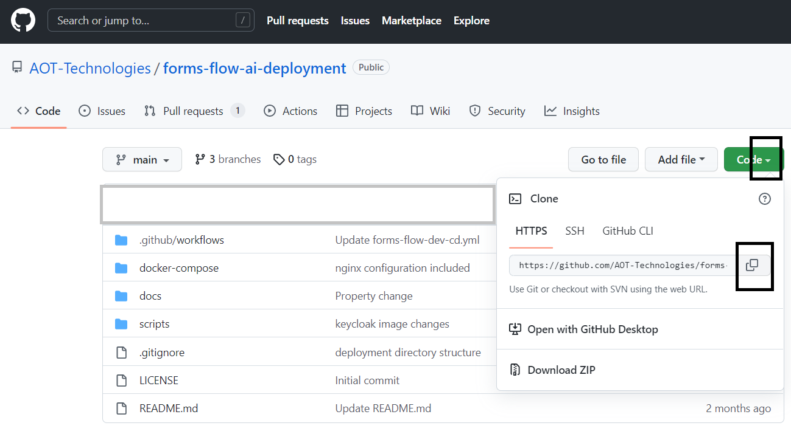
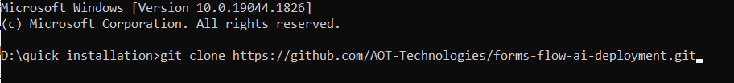
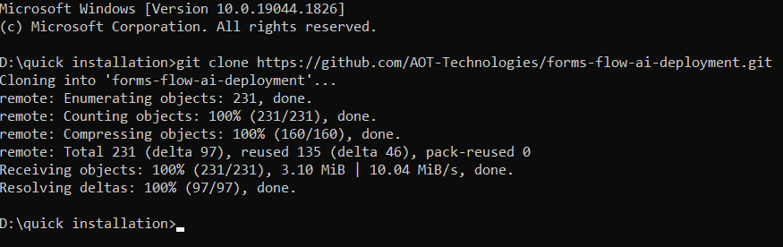
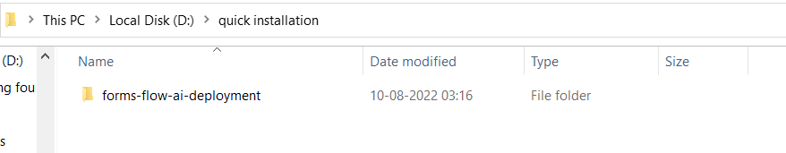
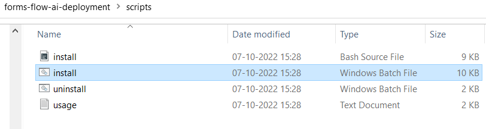
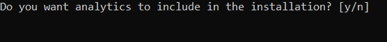
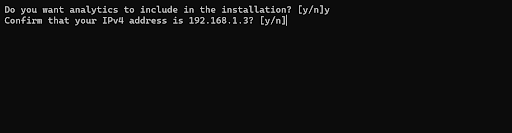
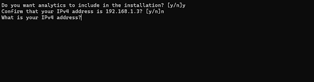
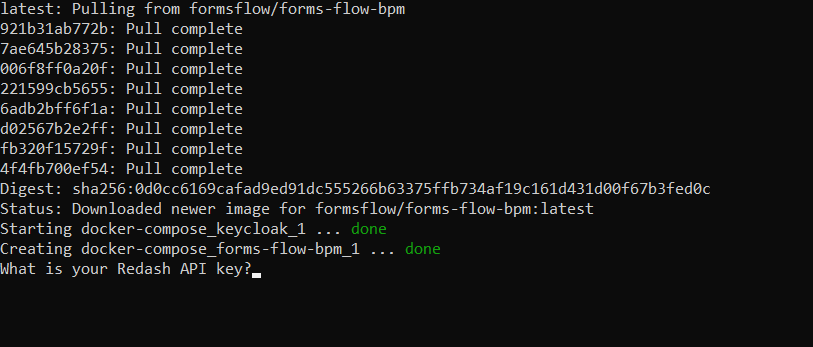
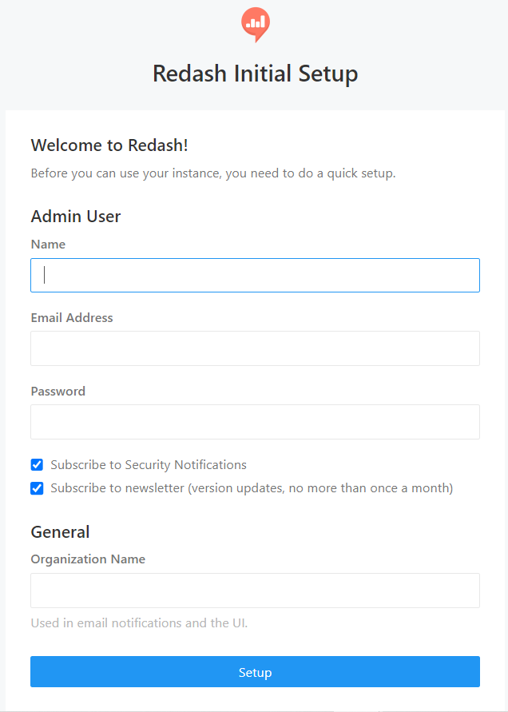

## Quick installation 

---

The quick-installation option saves time and labour, and is less error prone than manual installation. It helps you set up a running environment of formsflow.ai by installing the necessary packages and customizing the configuration files automatically.

### Prerequisites

- For installation of formsflow.ai, the Docker Desktop needs to be installed (for both Windows/Linux). If Docker has been installed, and if any previous formsflow.ai installations were done already, those need to be removed from the Docker Desktop.

## Steps for formsflow.ai Installation  

1.To start the formsflow.ai quick installation process, open the GitHub repository [https://github.com/AOT-Technologies/forms-flow-ai-deployment](https://github.com/AOT-Technologies/forms-flow-ai-deployment) .  
  
2.Clone the repository and copy this folder's contents to any local folder in your system. The steps to clone the folder:  
  
 *a*.  Expand the option code and clone the GitHub repository URL.  
 {: .ml-5}

   
 
 {: .mt-6 .ml-6}
 *b*.Create a new folder or open any folder on your machine, open the command prompt for the folder and clone this repository to the folder    using the command `git clone <repo name> `  
 {: .ml-5}

    
  
  {: .mt-6 .ml-6}  

 *c*. Once the repository is copied, the command prompt will display done, and all the folders in the repository will be present in the respective local folder.  
 {: .ml-5}

 
  {: .mt-6 .ml-6}
   
  {: .mt-6 .ml-6}  
  
3.Open the folder forms-flow-ai deployment>>Scripts>>Run the Install.bat/install.bash file for Windows/Linux respectively.  

 
  {: .mt-6 .ml-6}

4.The installation starts with the following question,

 
  {: .mt-6 .ml-6}  

  *a*.  If you need Redash Analytics Engine in the installation, provide ‘y’ as the answer, or else answer ‘n’. (To know more about Redash Analytics Engine, please visit [Redash](https://redash.io/help/) ).  
 {: .ml-5}

 
 {: .mt-6 .ml-6}  
 *b*. Verify the IP address is valid or incorrect after that. If true, provide  'y' as the answer, or else answer ‘n’.    

   
  {: .mt-6 .ml-6}  
 *c*. Provide the proper ip address.

5.As part of the installation, if the user has chosen the option to install with “Analytics” the user is asked to enter the Redash API key after the successful installation of Redash.  

 
  {: .mt-6 .ml-6} 

6.The Redash application should be available for use at port defaulted to 7000. Open [http://localhost:7000/](http://localhost:7000/) on your machine and register with any valid credentials.

 
  {: .mt-6 .ml-6} 

7.To get the Redash API key, log in to [http://localhost:7000/](http://localhost:7000/),Choose Settings>>Account, and copy the API Key.

 
  {: .mt-6 .ml-6} 

8.Copy the API Key and paste it into the cmd. The installation will continue.  

9.Once the installation is complete, the command prompt displays the installation is complete. The Docker Desktop displays all the installed containers.  

10.Health check can be applied.

### Health Check  

- Analytics should be up and available for use at port defaulted to 7000 i.e. [http://localhost:7000/](http://localhost:7000/).
- Business Process Engine should be up and available for use at port defaulted to 8000 i.e. [http://localhost:8000/camunda/](http://localhost:8000/camunda/).

- FormIO should be up and available for use at port defaulted to 3001 i.e. [http://localhost:3001/](http://localhost:3001/).
- formsflow.ai REST API should be up and available for use at port defaulted to 5000 i.e. [http://localhost:5000/checkpoint](http://localhost:5000/checkpoint).
- formsflow.ai web application should be up and available for use at port defaulted to 3000 i.e. [http://localhost:3000/](http://localhost:3000/). 
- Default user credentials are provided [here](https://aot-technologies.github.io/forms-flow-ai-doc/default%20user%20credential.html).

---

 [Next](/just-the-docs/Pages/Docker%20Based/DockerFull.html){: .btn .float-right }

  *Copyright© [formsflow.ai](https://formsflow.ai/)*   
  {: .text-center .mt-8 .pt-8}