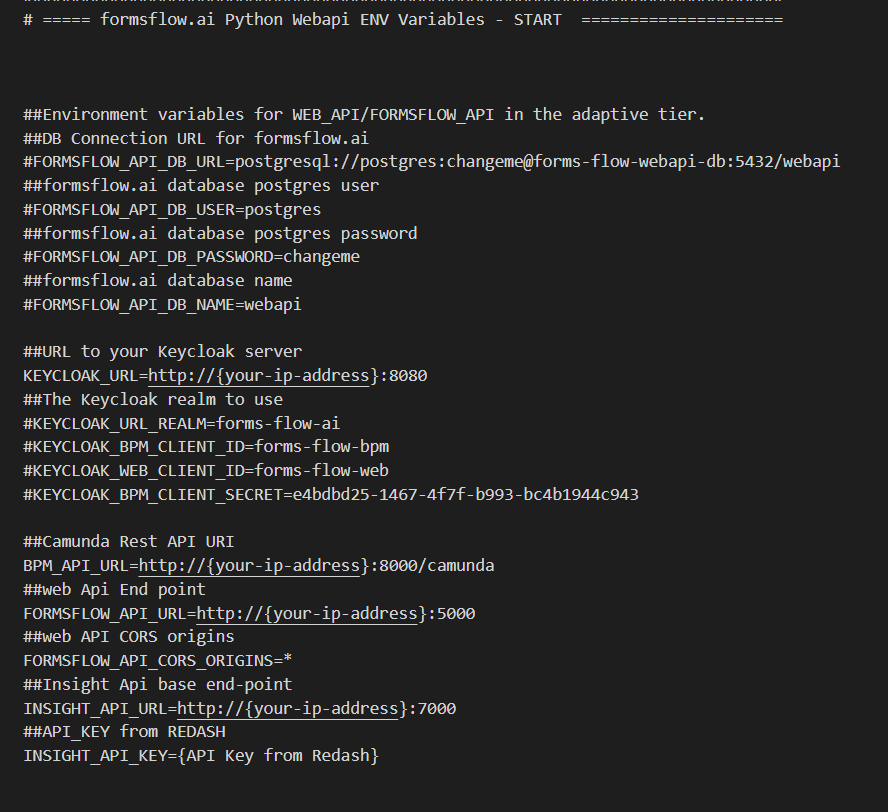
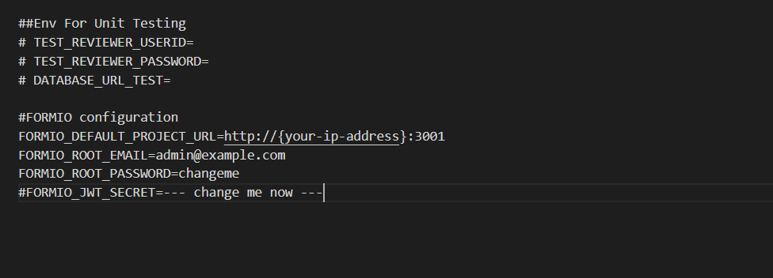

## Formsflow.ai API  

**Formsflow.ai** has built this adaptive tier for correlating form management, BPM and analytics together.

The goal of the REST API is to provide access to all relevant interfaces of the system. It is built using Python .

### Prerequisites

- For docker based installation [Docker](https://www.docker.com/) need to be installed.
- Admin access to Keycloak server and ensure audience(camunda-rest-api) is setup in Keycloak-bpm server.  

### Installation

If you are interested in contributing to the project, you can install through docker or locally.

It's recommended to download dev-packages to follow Python coding standards for project like PEP8 if you are interested in contributing to project. You installing dev-packages using pip as follows:

`python3 -m pip install -r requirements/dev.txt`

### Environment Configuration
- Make sure you have a Docker machine up and running.
- Make sure your current working directory is "forms-flow-ai/forms-flow-api".
- Rename the file sample.env to .env.
- Modify the environment variables in the newly created .env file if needed. Environment variables are given below.   

  

`INSIGHT_API_URL*` , `INSIGHT_API_KEY*` ,`KEYCLOAK_URL*`, `CAMUNDA_API_URL*`,`FORMSFLOW_API_URL`*  

> NOTE : Default realm is `forms-flow-ai`
{: .bg-grey-lt-000 .mt-8 .p-3}  

### Running the Application

- forms-flow-api service uses port 5000, make sure the port is available.
- `cd {Your Directory}/forms-flow-ai/forms-flow-api`
- Run `docker-compose up -d` to start.  

>   *NOTE: Use --build command with the start command to reflect any future .env changes eg : docker-compose up --build -d*  

### To Stop the Application

- Run `docker-compose stop` to stop. 

## Verify the Application Status

The application should be up and available for use at port defaulted to 5000 in [http://localhost:5000/](http://localhost:5000/)

- Access the **/checkpoint** endpoint for a Health Check on API to see it's up and running.  

GET http://localhost:5000/checkpoint   
\
RESPONSE   
\
{   
"message": "Welcome to formsflow.ai API"    
}   
{: .text-grey-lt-000 .bg-grey-dk-250 .p-6 .ml-3}  

  --- 
*Copyright© [formsflow.ai](https://formsflow.ai/)*
{: .text-center .mt-8}
