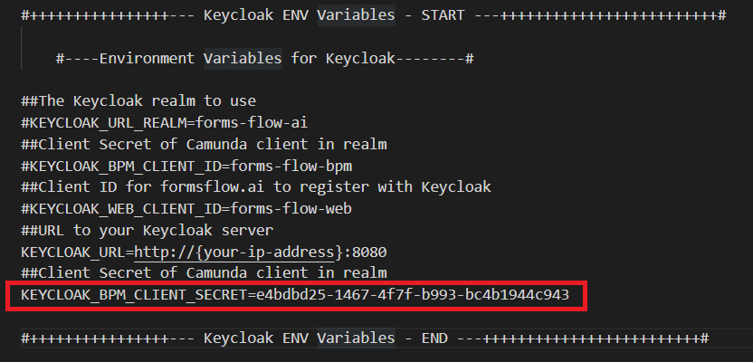
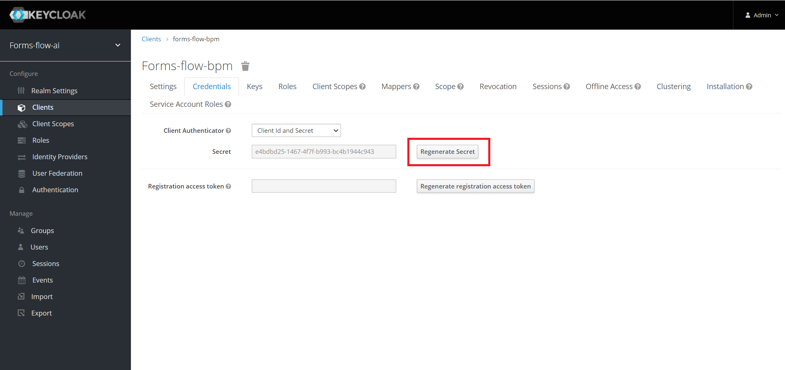
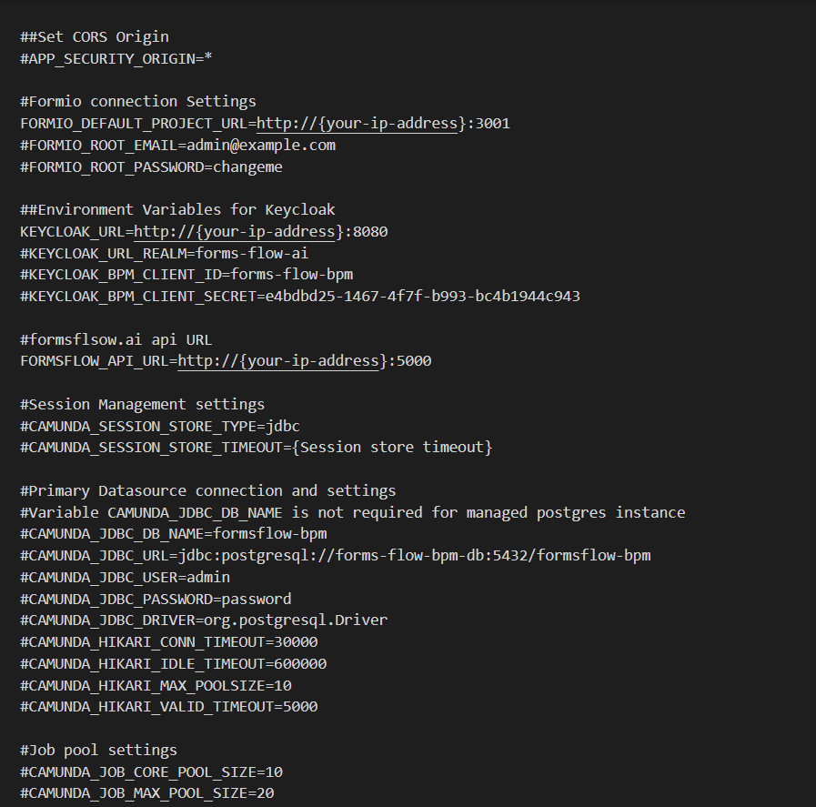
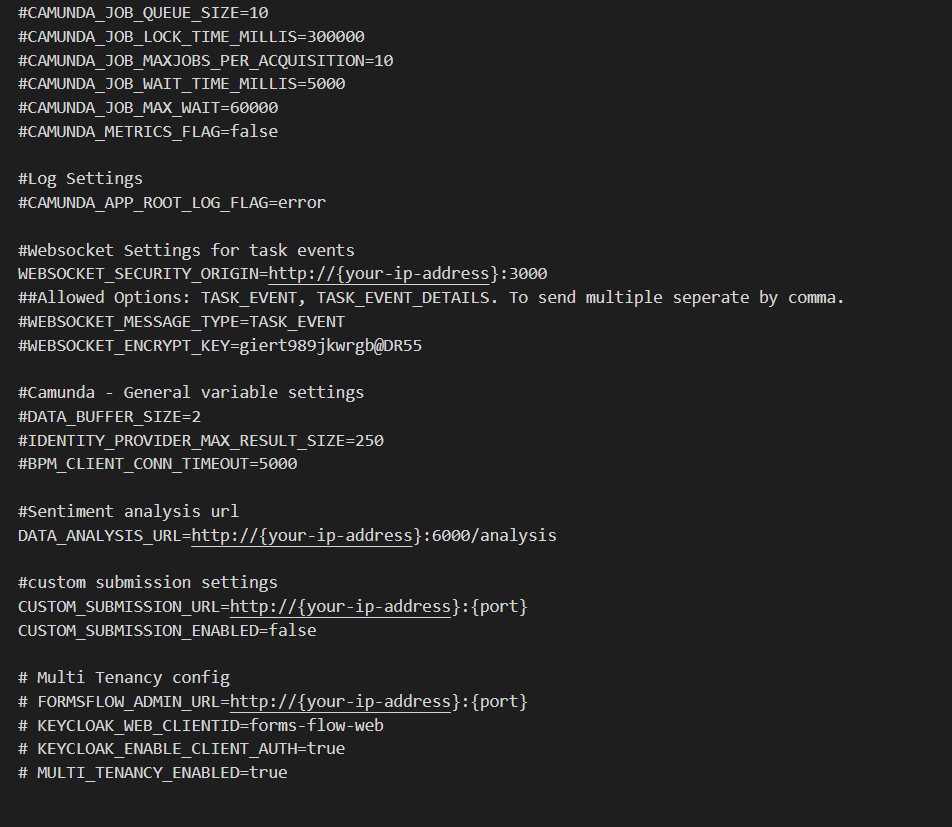
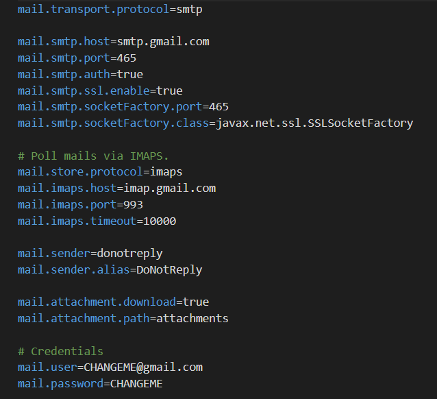
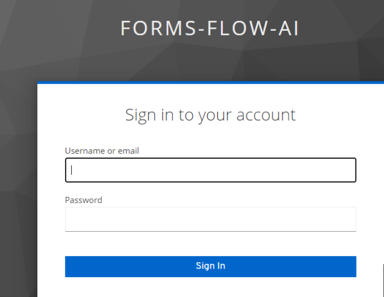

## Workflow Engine

---

**formsflow.ai** leverages Camunda for workflow and decision automation.

To know more about Camunda, visit [https://camunda.com/](https://camunda.com/)

### Prerequisites
For docker based installation [Docker](https://www.docker.com/) need to be installed.
Admin access to Keycloak serve

### Installation
- Make sure you have a Docker machine up and running.
- Make sure your current working directory is `forms-flow-ai/forms-flow-bpm`.
- Rename the file **sample.env** to **.env**.
- Modify the environment variables in the newly created **.env** file if needed. Environment variables are given below  

  

The KEYCLOAK_BPM_CLIENT_SECRET provided is the default value and each time you install the project you need to regenerate the SECRET key.  

#### **Get the Keycloak bpm client secret**
- Go to [http://localhost:8080](http://localhost:8080/) in the browser
- Login to KeyCloak Realm with admin privileges
- Configure > Clients >
- Click on Client ID = forms-flow-bpm
- Got to Credentials Tab
- Regenerate the secret and copy the value  

   

**Modify {your-ip-address} given inside the .env file to your host system IP address. Please take special care to identify the correct IP address if your system has multiple network cards.**  

 

> KEYCLOAK_URL*,KEYCLOAK_BPM_CLIENT_SECRET*,FORMSFLOW_API_URL*, FORMIO_DEFAULT_PROJECT_URL*,WEBSOCKET_SECURITY_ORIGIN*,BPM_BASE_URL* 
{: .bg-grey-lt-000 .mt-8 .p-3}  

### Mail Configuration(optional)
- Modify the **file mail-config.properties**(under forms-flow-bpm/src/main/resources/). The default settings provided are for the Gmail server, and you need to change the credentials at the bottom of the file. Note that you want to configure your own Gmail setting to allow unsecure apps first.  

### Running the application
- forms-flow-bpm service uses port 8000, make sure the port is available.
- `cd {Your Directory}/forms-flow-ai/forms-flow-bpm`
- Run `docker-compose up -d` to start.  

> NOTE : Use --build command with the start command to reflect any future .env changes eg : docker-compose up --build -d
{: .bg-grey-lt-000 .mt-8 .p-3}  

### To stop the application
- Run `docker-compose stop` to stop.  

## Health Check
- The application should be up and available for use at port defaulted to 8000 in [http://localhost:8000/camunda/](http://localhost:8000/camunda/)  

  

Default user credentials are provided <a href="https://aot-technologies.github.io/forms-flow-ai-doc/default%20user%20credential.html"  target="_blank" > here</a>  

  --- 
*Copyright© [formsflow.ai](https://formsflow.ai/)*
{: .text-center .mt-8}

 