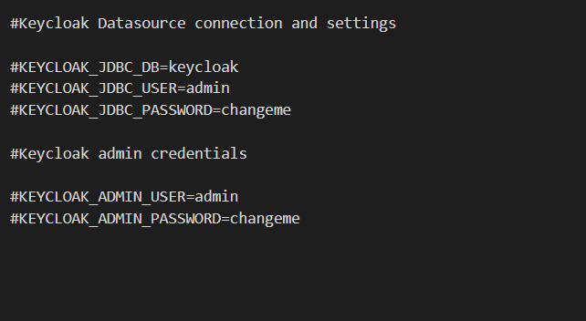
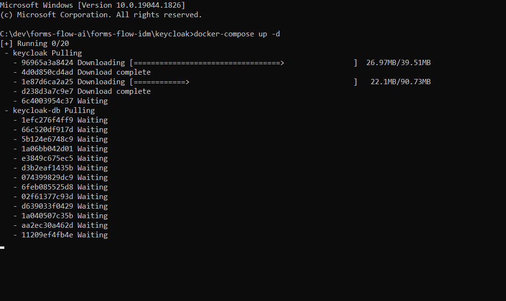
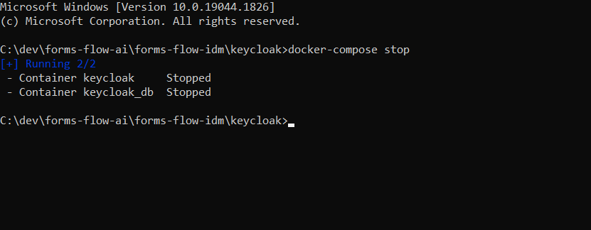
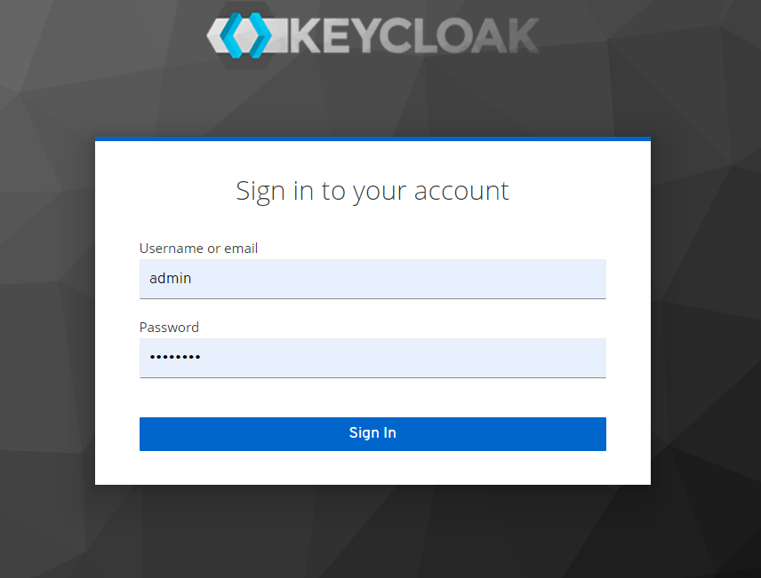

## Keycloak setup 

--- 

This setup is preferred for local development only. A docker instance will be created as part of setup.  

### Prerequisites  
- For docker based installation [Docker](https://www.docker.com/) needs to be installed.  

### Environment Configuration  

- Make sure you have a Docker machine up and running.
- Make sure your current working directory is cd {Your Directory}/forms-flow-ai/forms-flow-idm/keycloak
  * Optional: Rename the file sample.env to .env. Skip this step if you want to use the default values as mentioned in the table below.  

### Environment Variables  

 ---

   

### To start the keycloak server  

 - Run `docker-compose up -d` to start.  

   

 >  Use --build command with the start command to reflect any future changes  
 > `eg : docker-compose up --build -d`
 {: .bg-grey-lt-000}  

### To stop the keycloak server  

- Run `docker-compose stop `to stop.  

   

### Health Check    
\
 The application should be up and available for use in [http://localhost:8080](http://localhost:8080/)   
\
    

      Login Credentials
                            -----------------
                            User Name : admin
                            Password  : changeme

### How to add custom theme  

- Log in to [http://localhost:8080](http://localhost:8080/)
- Select Realm settings>Themes>Login Theme>formsflow>Save.
- Run `docker-compose up --build -d` to verify the changes.

---
  *Copyright© [formsflow.ai](https://formsflow.ai/)*   
  {: .text-center .mt-8}