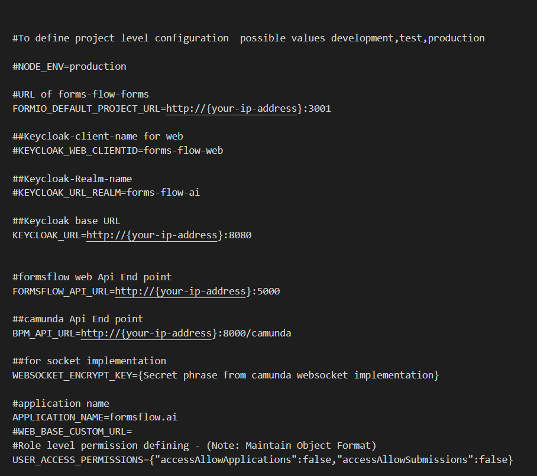
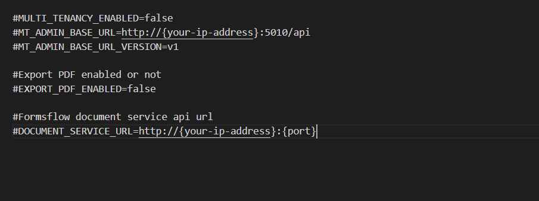

## formsflow.ai Web Application

---

**Formsflow.ai** delivers progressive web application with React version 17.0.2 and create-react-app. Also currently uses [form.io](https://github.com/formio/formio) version 2.3.0.

A React library for rendering out forms based on the form.io platform.

Also **formsflow.ai** provides a Vue.js based web user interface for easy integration of **formsflow.ai with your existing UI based on Vue**. To know more details checkout [formsflow-ai-extension repository](https://github.com/AOT-Technologies/forms-flow-ai-extensions/tree/master/camunda-formio-tasklist-vue), which can be easily intergrated with your project by installing our [npm package](https://www.npmjs.com/package/camunda-formio-tasklist-vue).

### Prerequisites
- For docker based installation [Docker](https://www.docker.com/) need to be installed.
- Admin access to a [Keycloak](https://www.keycloak.org/) server. For local development / testing follow Keycloak installation.
- Please make sure the Formio server is up and running.
### Installation
- Make sure you have a Docker machine up and running.
- Make sure your current working directory is "forms-flow-ai/forms-flow-web".
- Rename the file **sample.env** to **.env**.
- Modify the environment variables in the newly created **.env** file if needed. Environment variables are given below. 

  

>NOTE : FORMIO_DEFAULT_PROJECT_URL* ,FORMSFLOW_API_URL* ,CAMUNDA_API_URL*, KEYCLOAK_URL*
>While configuring USER_ACCESS_PERMISSIONS the accessAllowApplications will hide / show application tab, the same way accessAllowSubmissions does for viewSubmission button. To enable this feature you need to add access-allow-applications, access-allow-submissions with the respective user group in keycloak.
{: .bg-grey-lt-000 .mt-8 .p-3}   

### Running the application
- forms-flow-web service uses port 5000, make sure the port is available.
- `cd {Your Directory}/forms-flow-ai/forms-flow-web`
- Run `docker-compose up -d` to start.  

> *NOTE: Use --build command with the start command to reflect any future .env changes eg : `docker-compose up --build -d`*

### To stop the application
- Run `docker-compose stop` to stop.  

## Health Check
- The application should be up and available for use at port defaulted to 3000 in [http://localhost:3000/](http://localhost:3000/)
- Default user credentials are provided <a href="https://aot-technologies.github.io/forms-flow-ai-doc/default%20user%20credential.html"  target="_blank" > here</a> .  

  --- 
*Copyright© [formsflow.ai](https://formsflow.ai/)*
{: .text-center .mt-8}
