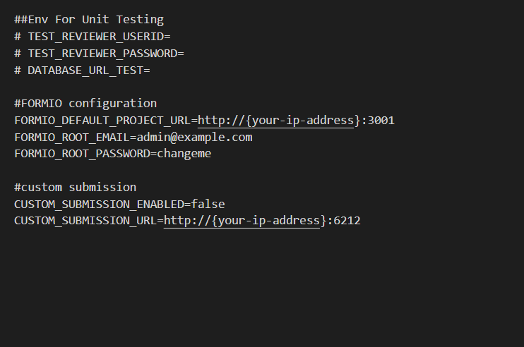

## formsflow.ai EXPORT API
--- 

The goal of the document API is to provide generate pdf with form submission data. It is built using Python :snake: .

### Prerequisites
- For docker based installation [Docker](https://www.docker.com/) need to be installed.
- Admin access to [Keycloak]() server and ensure audience(camunda-rest-api) is setup in Keycloak-bpm server. 

### Installation
If you are interested in contributing to the project, you can install through docker or locally.

It's recommended to download dev-packages to follow Python coding standards for project like PEP8 if you are interested in contributing to project. You installing dev-packages using pip as follows:

`python3 -m pip install -r requirements/dev.txt`

### Keycloak Setup
No specific client creation is required. Audience has been added for clients **forms-flow-web** and **forms-flow-bpm**.  

### Environment Configuration
- Make sure you have a Docker machine up and running.
- Make sure your current working directory is "forms-flow-ai/forms-flow-documents".
- Rename the file **sample.env** to **.env**.
- Modify the environment variables in the newly created **.env** file if needed. Environment variables are given in the table below,
- **NOTE : {your-ip-address} given inside the .env file should be changed to your host system IP address. Please take special care to identify the correct IP address if your system has multiple network cards**  

  

> KEYCLOAK_URL *, CAMUNDA_API_URL*, FORMSFLOW_API_URL*,FORMSFLOW_DOC_API_URL*
{: .bg-grey-lt-000 .mt-8 .p-3}   

**NOTE : Default realm is `forms-flow-ai`**  

### Running the Application
- forms-flow-api service uses port 5006, make sure the port is available.
- `cd {Your Directory}/forms-flow-ai/forms-flow-documents`

- Run `docker-compose up -d` to start.

>*NOTE: Use --build command with the start command to reflect any future .env changes eg : docker-compose up --build -d*

### To Stop the Application
- Run `docker-compose stop` to stop.  

## Verify the Application Status
The application should be up and available for use at port defaulted to 5006 in [http://localhost:5006/](http://localhost:5006/)

-Access the **/checkpoint** endpoint for a Health Check on API to see it's up and running. 

GET http://localhost:5006/checkpoint   
\
RESPONSE   
\
{   
  "message": "Welcome to formsflow.ai documents API"    
}
{: .text-grey-lt-000 .bg-grey-dk-250 .p-6 .ml-3}  

  --- 
*Copyright© [formsflow.ai](https://formsflow.ai/)*
{: .text-center .mt-8}