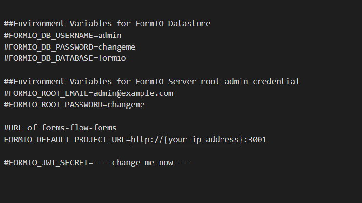
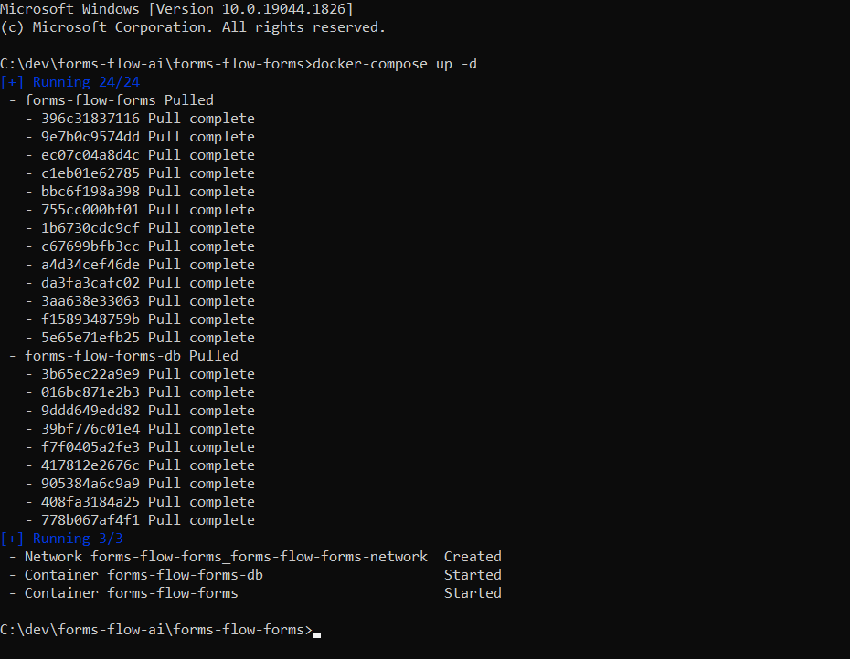
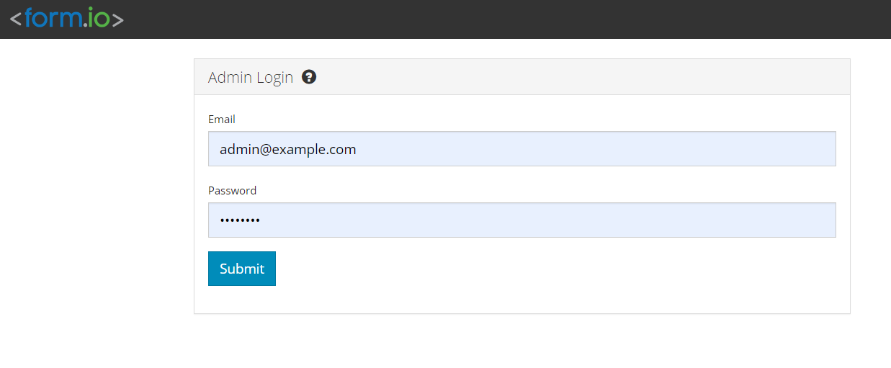

## Form Management Platform 

---
*Formsflow.ai* leverages form.io to build "serverless" data management applications using a simple drag-and-drop form builder interface.

To know more about form.io, go to [https://form.io](https://form.io/). 

### Prerequisites 

- For docker based installation [Docker](https://www.docker.com/) need to be installed.  

#### Installation  

- Make sure you have a Docker machine up and running.
- Make sure your current working directory is "forms-flow-ai/forms-flow-forms".
- Rename the file **sample.env** to **.env**.
- Modify the environment variables in the newly created **.env* *file if needed. Environment variables are given below.  

**NOTE :{your-ip-address} given inside the .env file should be changed to your host system IP address. Please take special care to identify the correct IP address if your system has multiple network cards.**  

    

> `FORMIO_DEFAULT_PROJECT_URL *`
{: .bg-grey-lt-000 .mt-8 .p-3}  

**Additionally, you may want to change these**{: .text-grey-dk-000 }
- The value of Mongo database details (especially if this instance is not just for testing purposes)
- The value of ROOT user account details (especially if this instance is not just for testing purposes)  

### Running the application
- forms-flow-forms service uses port 3001, make sure the port is available.
- `cd {Your Directory}/forms-flow-ai/forms-flow-forms`

- Run `docker-compose up -d to start`  

  
 
> *NOTE: Use --build command with the start command to reflect any future **.env** changes eg : `docker-compose up --build -d`*
{: .bg-grey-lt-000 .mt-8 .p-3}  

### To stop the application
- Run `docker-compose stop` to stop.

## Health Check
The application should be up and available for use at port defaulted to 3001 in (i.e. [http://localhost:3001/](http://localhost:3001/))

    

    Default Login Credentials
            -----------------
            User Name / Email : admin@example.com
            Password  : changeme

  --- 
*Copyright© [formsflow.ai](https://formsflow.ai/)*
{: .text-center .mt-8}

