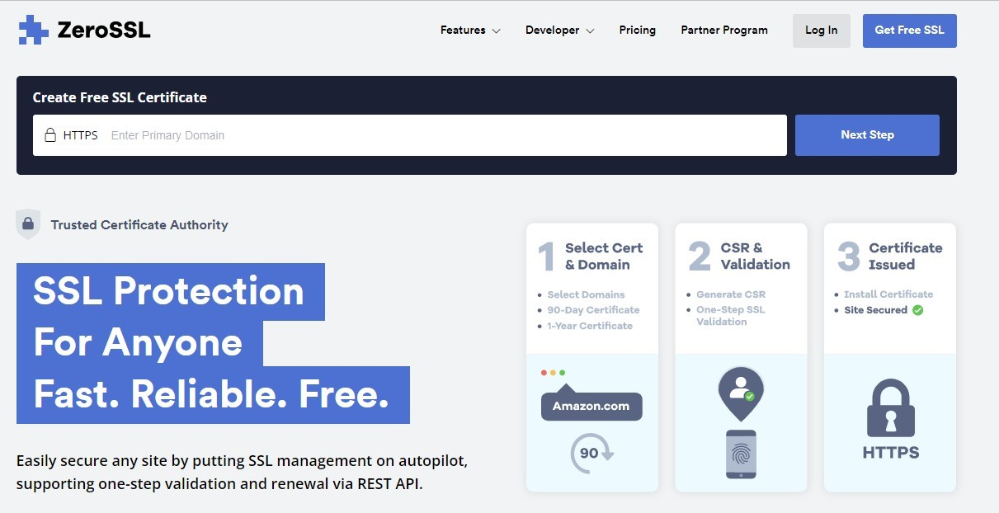
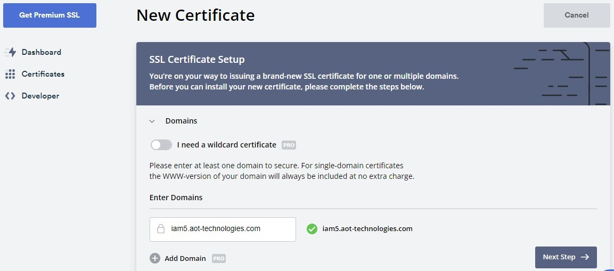
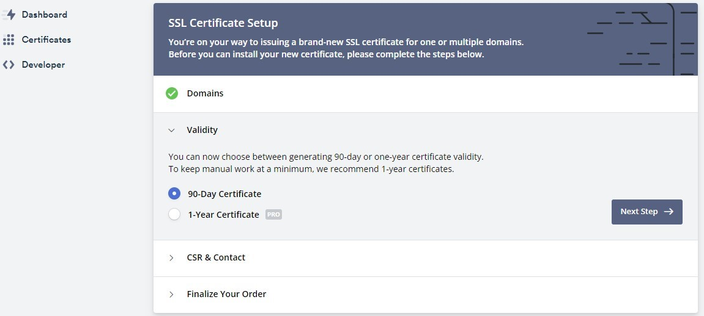
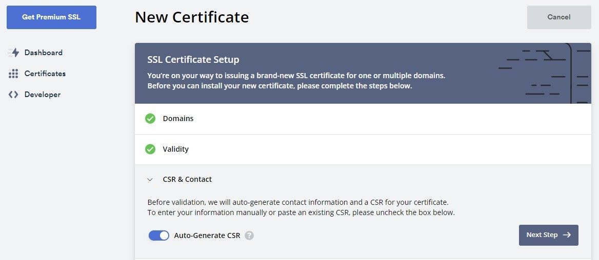
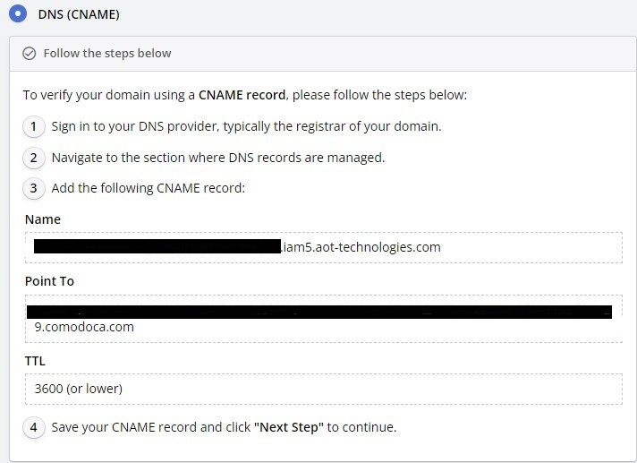

# Server Deployment
----
- ### Phase I :  
   **Purchase ssl for the domain name (both for identity management system and formsflow.ai)**

  ### Step 1:-  
  Purchase ssl from a trusted entity or can use letsencrypt to create a new ssl. We purchased ssl from zerossl as a 3 month free tier basis.  

  
  
  
    

In the next window, we can see a free 90 days certificate is already selected along with other purchase options. Click next and continue with the process.  

Next, we need to complete the validation of the certificate, for that select DNS validation from the given window and create a CNAME record in your domain with given values.  

  

After the validation, click next and download the zip file of the certificate. The zip file contains one private key, one certificate file and one bundle file.  
### Step 2:-  
 Open a blank notepad file and copy the content from the file __certificate.crt__ and paste it into the notepad file, in the same file also paste the content from __ca_bundle.crt__ file following the content of the certificate.crt and save the notepad file as __cert.pem__.   

 Copy the __cert.pem__ file and __private.key__, and paste it into the folder where we are going to configure the Nginx docker.  
 Here we are having two domains, one for identity management and the other for formsflow.ai, so we are having two cert.pem files and two private.key files.   

- ### Phase  II :   

**This step should do after deploying all the forms-flow components in server.**  
Setting up identity management server, forms flow app, analytics server, and mapping the domain.  
Inside the folder `forms-flow-nginx`, create three folders with domain names of keycloak, app, and analytics.

Consider your domain name is __example.com__, then you have to purchase three SSL for three domains, keycloak.example.com, app.example.com, and analytics.example.com (domain can decide according to your wish).  

Copy the __private.key__ and __cert.pem__ files of their corresponding directories with domain name There will be a shell script file named `'runme.sh'` , you can run that file using the command `$ bash runme.sh`.  

After running this command , nginx container will up and we can use the public ip of the server for further use.  
Create A record in your DNS server with each domain names and value of that A record will be that public IP.  

----

*Copyright© [formsflow.ai](https://formsflow.ai/)*   
{: .text-center .mt-8 .pt-8}